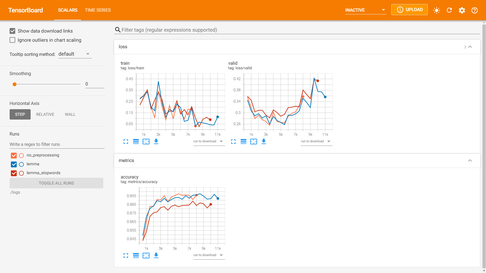
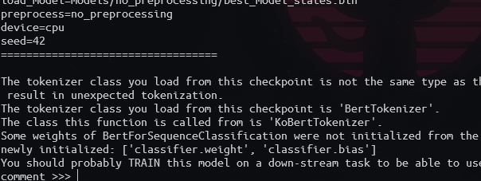

# NSMC classification using KoBERT

- 2021 가을학기 자연어처리와 딥러닝 과제
- KoBERT 를 이용한 네이버 영화리뷰 코퍼스 감정 분류
- [`yonlu`](https://github.com/MinSong2/yonlu), [`KoBERT-nsmc`](https://github.com/monologg/KoBERT-nsmc) 저장소의 코드 참고(조기종료, 텐서보드, 실험 기록 등 편의성 추가)

## Requirements

```
torch==1.8.0 
kobert-transformers==0.5.1
transformers==4.11.2
tensorboard==2.6.0
treform     
```

## Preprocessing

`preprocess.py` 스크립트는 학습, 검증 데이터셋을 분리하고 nsmc 데이터셋을 전처리를 수행합니다. 
기본 파라미터로 학습 시 전처리를 하지 않은 경우 성능이 가장 우수합니다. 

```bash
$ python preprocess.py
```

## Main script

`main` 스크립트는 `train`, `test`, `interactive` 모드로 실행할 수 있습니다.

### Training

모델은 `models/expr_name` 디렉토리에 저장되고, 텐서보드 로그는 `logs/expr_name` 디렉토리에 저장됩니다. 
학습을 마치면 `experiments.json` 파일에 사용한 인자와 검증 데이터셋 성능이 기록됩니다.

<p align="center"></img></p>

```bash 
$ python main.py --mode train --expr_name no_preprocessing
$ cat experiments.json
[
     {
        "mode": "train",
        "expr_name": "no_preprocessing",
        "train": "./data/train.txt",
        "valid": "./data/valid.txt",
        "test": "./data/test.txt",
        "max_len": 100,
        "train_batch_size": 64,
        "valid_batch_size": 1024,
        "lr": 2e-05,
        "beta_1": 0.9,
        "beta_2": 0.999,
        "weight_decay": 0.5,
        "num_warmup_steps": 500,
        "num_epochs": 10,
        "eval_every": 500,
        "early_stopping_rounds": 5,
        "bert_model_name": "monologg/kobert",
        "load_model": null,
        "device": "cuda",
        "seed": 42,
        "valid_accuracy": 0.8974299143304777
    }
]  
``` 

### Test

`test` 모드로 실행하면 테스트 데이터셋에 대해 성능을 평가합니다.
기본 파라미터로 실행시 평가 데이터셋 에 대해 약 `0.8945` 의 성능을 보입니다. 

```bash
$ python main.py \
    --mode test \
    --test "./data/test.txt" \
    --load_model "models/no_preprocessing/best_model_states.bin"
```

### Interactive

`interactive` 모드로 실행하면 사용자가 입력하는 댓글에 대해 분류를 수행합니다.

```bash
$ python main.py \
    --mode interactive \
    --load_model "models/2021-10-05 21:02:20.792095/best_model_states.bin" \
    --device cpu
```




## References

- [KoBERT](https://github.com/SKTBrain/KoBERT)
- [KoBERT-Transformers](https://github.com/monologg/KoBERT-Transformers)
- [Huggingface Transformers](https://github.com/huggingface/transformers)
- [NSMC](https://github.com/e9t/nsmc)
- [Treform](https://github.com/MinSong2/treform)
- [Yonlu](https://github.com/MinSong2/yonlu)
